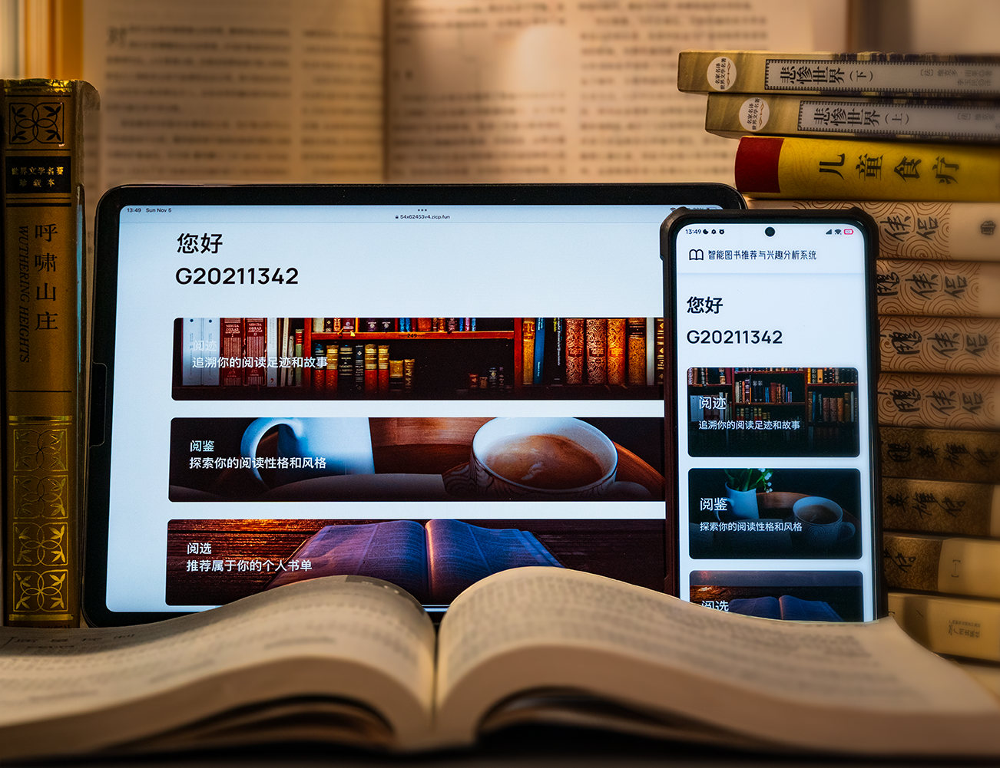
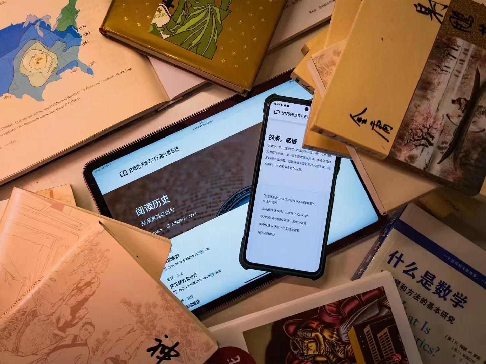

# 2023 Tencent Rhino–Bird Middle School Science Research Training Program

### Intelligent Book Recommendation and User Interest Analysis System Based on Factorization Machines

**Oct 2023**: Won the Excellent Award in 2023 Tencent Rhino–Bird Middle School Science Research Training Proogram

  

In response to the new characteristics of the demand for smart libraries in the  information age and the practical requirements put forward by readers during reading,  we have developed an intelligent recommendation system that integrates reader interest  analysis and personalized book recommendation functions.

**Authors**: [Zirui Zhang](https://github.com/zhangzrjerry) and [Peng Yue](https://github.com/edward-yue-peng) from the Guangzhou No.2 High School

